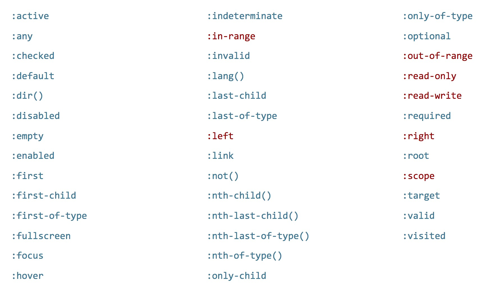
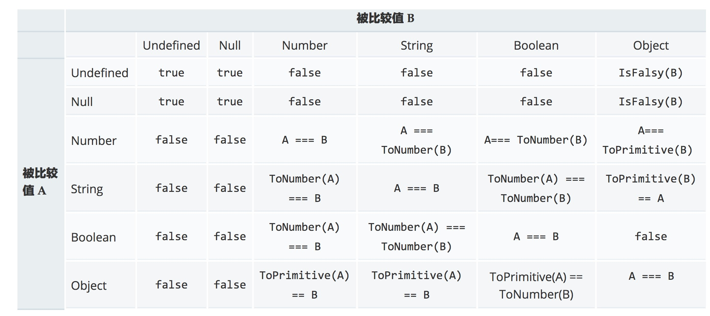
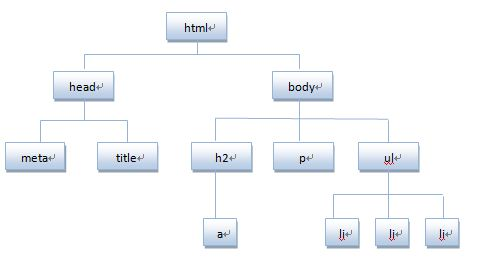
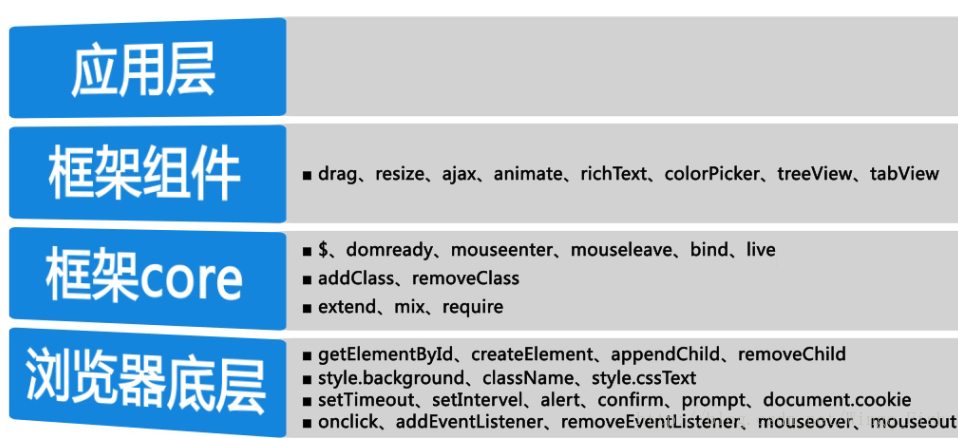

Web 前端分享 第二期
===

> 2017-07-26 发布，最后更新于 2017-07-27

## （一）那些重要却总被忽视的 HTML 招式

#### 1. DOCTYPE 声明

###### 我们经常会遇到不同的 DOCTYPE 声明方式，Eg:

HTML 5:

        <!DOCTYPE html>

HTML 4.01 Strict:

        <!DOCTYPE HTML PUBLIC "-//W3C//DTD HTML 4.01//EN" "http://www.w3.org/TR/html4/strict.dtd">

HTML 4.01 Transitional:

        <!DOCTYPE HTML PUBLIC "-//W3C//DTD HTML 4.01 Transitional//EN" "http://www.w3.org/TR/html4/loose.dtd">

...

###### 什么是 DOCTYPE 声明？它影响什么？

DOCTYPE 告知浏览器当前的 HTML (或 XML) 文档是哪一个版本，它是一条声明, 而不是一个标签; 也可以把它叫做 "文档类型声明", 或简称为 "DTD（document type declaration）".

不同文档类型对应的识别标签范围不同，详见: [HTML 元素和有效的 DTD](http://www.w3school.com.cn/tags/html_ref_dtd.asp)

DOCTYPE 也会影响浏览器渲染模式（Q: 混杂模式, A: 近标准模式, S: 标准模式），应设置成 `<!DOCTYPE html>`，确保 IE8+ / Opera9+ / Firefox10+ / Chrome10+ / Safari10+ 为标准模式，另外此时 IE6、IE7 会解析为近标准模式

#### 2. 元数据

元数据是描述数据的数据，使用 [<meta> 元素](https://developer.mozilla.org/zh-CN/docs/Web/HTML/Element/meta) 来为文档添加元数据。

`<meta>` 包含 `name` 和 `content` 属性:

* `name` 指定 meta 元素类型; 说明该元素包含了什么类型的信息。
* `content` 指定元数据内容

Eg:

指定文档字符编码：

        <meta charset="UTF-8">

设定视口属性：

        <meta name="viewport" content="width=device-width, initial-scale=1.0, maximum-scale=1.0, user-scalable=no">

渲染内核设置，使用 meta 标签来强制 IE8 使用最新的内核渲染页面，避免 IE8 使用“兼容性视图”功能：

        <meta http-equiv="X-UA-Compatible" content="IE=edge, chrome=1">

引导360浏览器（双核）使用 webkit 内核渲染网页：

        <meta name="renderer" content="webkit">

网页 TDK 设置：

        <meta name="keywords" content="嗨学网,嗨学,一级建造师,二级建造师,司法考试,注册会计师,执业药师,一级注册消防工程师,互动,课堂,智能,题库,问答,系统,移动,嗨学,嗨学网登录,王玮老师,李四德老师,杨海军老师,盛英会老师,王霞老师,张千老师,嗨学网视频,嗨学网招聘,嗨学网师资,嗨学网课程">

浏览器辅助功能开关：

        <meta name="format-detection" content="telephone=no" />

#### 3. 块级元素和内联元素

* 块级元素在页面中以块的形式展现 —— 相对于其前面的内容它会出现在新的一行，其后的内容也会被挤到下一行展现。块级元素通常用于展示页面上结构化的内容，类似于段落、列表、导航菜单、页脚等等。一个以 block 形式展现的块级元素不会被嵌套进内联元素中，但可以嵌套在其它块级元素中。
* 内联元素通常出现在块级元素中并被一些其它文本所包围，而不是一整个段落或者一组内容。内联元素不会导致文本换行：它通常出现在一堆文字之间例如超链接元素 `<a>` 或者强调元素 `<em>` 和 `<strong>`
* [块级元素列表](https://developer.mozilla.org/zh-CN/docs/Web/HTML/Block-level_elements)
* [行内元素列表](https://developer.mozilla.org/zh-CN/docs/Web/HTML/Inline_elemente)

嵌套规则：

1. 块元素可以包含内联元素或某些块元素，但内联元素却不能包含块元素，它只能包含其它的内联元素
2. 块级元素不能放在 `<p>` 里面
3. 有几个特殊的块级元素只能包含内嵌元素，不能再包含块级元素，这几个特殊的标签是: h1~6、p、[dt](https://developer.mozilla.org/zh-CN/docs/Web/HTML/Element/dt)

#### 4. IE Hack

* lt: 小于
* gt: 大于
* lte: 小于等于
* gte: 大于等于
* !: 不等于

Eg:

        <!--[if IE]>
            IE 浏览器生效
        <![endif]-->

        <!--[if IE 8]>
            仅在 IE8 下生效
        <![endif]-->

        <!--[if gte IE 8]>
            在大于等于 IE8 版本的浏览器下生效
        <![endif]-->

        <!--[if !IE 10]>
            非 IE10 的浏览器下生效
        <![endif]-->

#### 5. 特殊字符的实体引用

常用：

|Literal character|Character reference equivalent|
|----|----|
|<|`&lt;`|
|>|`&gt;`|
|"|`&quot;`|
|'|`&apos;`|
|&|`&amp;`|
|不间断空格|`&nbsp;`|
|全角空格|`&emsp;`|
|半角空格|`&ensp;`|
|©|`&copy;`|

[HTML特殊字符编码对照表](http://www.jb51.net/onlineread/htmlchar.htm)

## （二）CSS 基础

#### 1. CSS 规则


[CSS 属性速查](http://www.css88.com/book/css/quicksearch.htm)

#### 2. 不同种类的 CSS 选择器

###### 简单选择器

简单选择器基于元素的类型（或其 class 或 id）直接匹配文档的一个或多个元素

```css
/* 元素选择器 */
ul, ol, dl {
  margin: 0;
  padding: 0;
  list-style: none;
}


/* 类选择器 */
.mt10 {
    margin-top: 10px;
}

.live-pptCtrl--btn {
    display: inline-block;
    width: 25px;
    height: 25px;
    ...
}

/* id 选择器 */
#percentCvs {
    width: 42px;
    height: 42px;
    ...
}

/* 通用选择器 */
* {
    padding: 5px;
    border: 1px solid black;
    background: rgba(255,0,0,0.25);
}
```

###### 属性选择器

`E[att] { sRules }` 选择具有 `att` 属性的 `E` 元素，Eg:
```css
img[alt] {
    margin: 10px;
}
```

`E[att="val"] { sRules }` 选择具有 `att` 属性且属性值等于 `val` 的 `E` 元素
`E[att~="val"] { sRules }` 选择具有 `att` 属性且属性值中有 `val` 的 `E` 元素
`E[att^="val"] { sRules }` 选择具有 `att` 属性且属性值为以 `val` 开头的 `E` 元素
`E[att$="val"] { sRules }` 选择具有 `att` 属性且属性值为以 `val` 结尾的 `E` 元素
`E[att*="val"] { sRules }` 选择具有 `att` 属性且属性值字符串包含 `val` 的 `E` 元素
`E[att|="val"] { sRules }` 选择具有 `att` 属性且属性值为以 `val` 开头并用连接符 "-" 分隔的字符串的 `E` 元素，如果属性值仅为 `val` ，也将被选择

###### 伪类

一个 CSS 伪类是一个以冒号(:)作为前缀的关键字，当你希望样式在特定状态下才被呈现到指定的元素时，你可以往元素的选择器后面加上对应的伪类



Eg:

```css
a:hover,
a:active,
a:focus {
    color: darkred;
    text-decoration: none;
}
```

###### 伪元素

就像 pseudo classes (伪类)一样， 伪元素添加到选择器，但不是描述特殊状态，它们允许您为元素的某些部分设置样式。 例如， `::first-line` 伪元素只定位由选择器指定的元素的第一行

* `::after`
* `::before`
* `::first-letter`
* `::first-line`
* `::selection`

Eg.清除浮动:

```css
.clearfix {
  zoom: 1;
}
.clearfix:after {
  content: "";
  display: block;
  height: 0;
  visibility: hidden;
  clear: both;
}
```

###### 关系选择器

|Combinators|Select|
|----|----|
|A B|匹配任意元素，满足条件：B是A的后代结点（B是A的子节点，或者A的子节点的子节点）|
|A>B|匹配任意元素，满足条件：B是A的直接子节点|
|A+B|匹配任意元素，满足条件：B是A的下一个兄弟节点（AB有相同的父结点，并且B紧跟在A的后面）|
|A~B|匹配任意元素，满足条件：B是A之后的兄弟节点中的任意一个（AB有相同的父节点，B在A之后，但不一定是紧挨着A）|

注意 IE 兼容性：

IE8 支持 [兄弟选择符(E~F)](http://www.css88.com/book/css/selectors/relationship/e-brother-f.htm) 和属性选择符: [E[att^="val"]](http://www.css88.com/book/css/selectors/attribute/att4.htm)、[E[att$="val"]](http://www.css88.com/book/css/selectors/attribute/att5.htm)、[E[att*="val"]](http://www.css88.com/book/css/selectors/attribute/att6.htm)

IE8 不支持 [E:root](http://www.css88.com/book/css/selectors/pseudo-classes/root.htm)、[E:nth-child(n)](http://www.css88.com/book/css/selectors/pseudo-classes/nth-child(n).htm)、[E:nth-last-child(n)](http://www.css88.com/book/css/selectors/pseudo-classes/nth-last-child(n).htm)、[E:nth-of-type(n)](http://www.css88.com/book/css/selectors/pseudo-classes/nth-of-type(n).htm)、[E:nth-last-of-type(n)](http://www.css88.com/book/css/selectors/pseudo-classes/nth-last-of-type(n).htm)、[E:last-child](http://www.css88.com/book/css/selectors/pseudo-classes/last-child.htm)、[E:first-of-type](http://www.css88.com/book/css/selectors/pseudo-classes/first-of-type.htm)、[E:last-of-type](http://www.css88.com/book/css/selectors/pseudo-classes/last-of-type.htm)、[E:only-child](http://www.css88.com/book/css/selectors/pseudo-classes/only-child.htm)、[E:only-of-type](http://www.css88.com/book/css/selectors/pseudo-classes/only-of-type.htm)、[E:empty](http://www.css88.com/book/css/selectors/pseudo-classes/empty.htm)、[E:target](http://www.css88.com/book/css/selectors/pseudo-classes/target.htm)、[E:enabled](http://www.css88.com/book/css/selectors/pseudo-classes/enabled.htm)、[E:disabled](http://www.css88.com/book/css/selectors/pseudo-classes/disabled.htm)、[E:checked](http://www.css88.com/book/css/selectors/pseudo-classes/checked.htm)、[E:not(s)](http://www.css88.com/book/css/selectors/pseudo-classes/not(s).htm)

以上 CSS3 选择器 IE9+ 均支持，[兼容性参考](http://caniuse.com/#search=CSS3%20selectors)

#### 3. 盒模型

###### 概念

在写 CSS 时你会发现大部分都是关于盒模型的——设置它们的尺寸，颜色，位置等等。CSS 布局就是基于盒模型的。每个占据页面空间的块级元素都有相似的属性：

* 内边距（padding）, 围绕着内容的空间（比如围绕段落的空间）
* 边框（border）, 紧接着内边距的实体线段
* 外边距(margin), 围绕元素外部的空间


margin -> border -> padding -> content


盒子的大小：content + padding + border

###### 2种盒模型

盒模型分为2种，IE8+ 浏览器通过 `box-sizing` 来设置：

* 标准盒模型（默认）：`box-sizing: content-box`，`width/height` = content 区域
* 怪异盒模型：`box-sizing: border-box`，`width/height` = content + padding + border

###### 定位

`position` 有4个值：

* static: 对象遵循常规流。此时4个定位偏移属性（top, right, bottom, left）不会被应用
* relative: 对象遵循常规流，并且参照自身在常规流中的位置通过定位偏移属性进行偏移时不会影响常规流中的任何元素
* absolute: 对象脱离常规流，此时偏移属性参照的是离自身最近的定位祖先元素，如果没有定位的祖先元素，则一直回溯到 body 元素。盒子的偏移位置不影响常规流中的任何元素，其 margin 不与其他任何 margin 折叠
* fixed: 与 absolute 一致，但偏移定位是以窗口为参考。当出现滚动条时，对象不会随着滚动

类比一下：static（活人），relative（没火华的尸体），absolute（灵魂出窍），fixed（阴魂不散）

`z-index`

设置对象的层叠顺序，适用于定义了 `position` 为非 `static` 的元素

#### 4. 浏览器渲染过程


1. HTML 解析生成 DOM 树；CSS 解析生成 CSS 规则
2. 分析 DOM 树和 CSS 规则，整合成一棵 Render Tree，最终用来进行绘图渲染。（`display: none;` 的元素会被 Render Tree 无视）
3. 根据 Render Tree 进行 Layout、Painting，最终 Display

在建立 Render Tree 的过程中（WebKit 中的「Attachment」过程），浏览器就要为每个 DOM Tree 中的元素根据 CSS 的解析结果（Style Rules）来确定生成怎样的 renderer。对于每个 DOM 元素，必须在所有 Style Rules 中找到符合的 selector 并将对应的规则进行合并。选择器的「解析」实际是在这里执行的，在遍历 DOM Tree 时，从 Style Rules 中去寻找对应的 selector。

因为所有样式规则可能数量很大，而且绝大多数不会匹配到当前的 DOM 元素，所以有一个快速的方法来判断「这个 selector 不匹配当前元素」就是极其重要的。

比较正向解析与逆向解析：「div div p em」

#### 5. 如何实现响应式布局？

一个网站能够兼容多个终端显示，而不是为每个终端做一个特定的版本。这个概念是为解决移动互联网浏览而诞生的。

###### 媒体查询 Media Queries

通过不同的媒体类型和条件定义样式表规则。

* 媒体查询让 CSS 可以更精确作用于不同的媒体类型和同一媒体的不同条件。
* 媒体查询的大部分媒体特性都接受 min 和 max 用于表达“大于或等于”和“小与或等于”

媒体查询可以获取哪些值？

* 设备屏幕宽高：device-width, device-height
* 渲染窗口宽高：width, height
* 设备的手持方向：orientation
* 设备宽高比例：device-aspect-ratio
* 设备分辨率：resolution
...

Eg:

```css
/*----- 响应式控制  -----*/
@media (max-width: 1200px) {
  /* 第一屏 */
  .index-navBox {
    width: 940px;
  }
  .index-loginWrapper {
    margin-left: -470px;
    width: 940px;
  }
}

@media (max-width: 991px ) {
  /* 第一屏 */
  .index-navBox {
    width: 720px;
  }
  .index-loginWrapper {
    margin-left: -360px;
    width: 720px;
  }
}

@media (max-width: 700px ) {
  .index-carousel {
    position: inherit;
  }
  .index-loginWrapper {
    margin-top: 0;
    top: 55px;
  }
}
```

注：IE8 不支持 Media Query

## （三）重新认识 JavaScript

#### 1. 被人误解最深的编程语言

> JavaScript 堪称 [世界上被人误解最深的编程语言](http://javascript.crockford.com/javascript.html)。虽然常被嘲为“玩具语言”，但在它看似简洁的外衣下，还隐藏着强大的语言特性。

> 与大多数编程语言不同，JavaScript 没有输入或输出的概念。它是一个在宿主环境（host environment）下运行的脚本语言，任何与外界沟通的机制都是由宿主环境提供的。浏览器是最常见的宿主环境，但在非常多的其他程序中也包含 JavaScript 解释器，如 Adobe Acrobat、Photoshop、SVG 图像、Yahoo! 的 Widget 引擎，以及 Node.js 之类的服务器端环境。

Js 是一种面向对象的动态语言，它包含类型、运算符、标准内置对象和方法

* Js 不支持类，类这一概念在 Js 通过对象原型（object prototype）得到延续，ES6 中通过 class 封装类
* Js 中函数也是对象，Js 允许函数在包含可执行代码的同时，能像其他对象一样被传递

#### 2. 类型检测

###### JS 中的数据类型

* Number
* String
* Boolean
* Null
* Undefined
* Symbol
* Object
    * Function
    * Array
    * Date
    * RegExp
* Error

###### 三种比较操作：

* 严格相等，使用 `===`
* 非严格相等，使用 `==`，存在隐式转换
* [Object.is](https://developer.mozilla.org/zh-CN/docs/Web/JavaScript/Reference/Global_Objects/Object/is)

隐式转换 Eg：

```javascript
null == undefined // true
1 == "1.0" // true
1 == true // true

NaN === NaN // false, NaN 与任何数据类型均不等
```

附：非严格相等判断表



###### 类型检测

* typeof：适合基本类型及 function 检测，遇到 null 失效
* instanceof 适合自定义对象检测，在不同 iframe 和 window 间检测时失效
* Object.prototype.toString：IE 6/7/8 下 null 和 undefined 失效
* constructor
* duck type

```javascript
// typeof 适合函数对象和基本类型的判断
typeof 100 // "number"
typeof function() {} // "function"

typeof new Object() // "object"
typeof [1, 2] // "object"
typeof null // "object", 历史原因

// 判断对象类型，更常用 instanceof，基于原型链的判断
A instanceof B // 判断 A 对象的原型链上是否有 B 构造函数的 prototype 属性

[1, 2] instanceof Array // true
new Object() instanceof Array // false

// Object.prototype.toString
Object.prototype.toString.apply([]) // "[object Array]"
Object.prototype.toString.apply(function() {}) // "[object Function]"
Object.prototype.toString.apply(null) // "[object Null]"
Object.prototype.toString.apply(undefined) // "[object Undefined]"

// 注：IE 6/7/8 Object.prototype.toString.apply(null) 返回 [object Object]
```

附：[jQuery 和 lodash 都在用的类型检测模块](https://github.com/AnHongpeng/wheel/blob/master/utils/detector/index.js)

#### 3. 认识 DOM

DOM（Document Object Model），文档对象模型，定义访问和处理 HTML 文档的标准方法。DOM 将 HTML 文档呈现为带有元素、属性和文本的树结构（节点树）

```html
<!DOCTYPE html>
<html>
<head>
    <meta charset="UTF-8">
    <title>DOM</title>
</head>
<body>
    <h2><a href="#">DOM</a></h2>
    <p>对 DOM 元素进行操作</p>
    <ul>
        <li>HTML</li>
        <li>CSS</li>
        <li>JS</li>
    </ul>
</body>
</html>
```

上面代码对应的节点树结构：



DOM 节点包括：元素节点、文本节点、属性节点

* 访问节点：
    * getElementById
    * getElementsByName
    * getElementsByTagName
    * elementNode.childNodes
    * elementNode.parentNode
* 插入节点：
    * appendChild
    * insertBefore
* 删除节点：
    * removeChild
* 替换节点：
    * replaceChild
* 创建节点：
    * createElement
    * createTextNode

附：[DOM 事件标准](https://w3c.github.io/uievents/)

#### 4. Ajax 与 [XMLHttpRequest](https://dvcs.w3.org/hg/xhr/raw-file/tip/Overview.html)

> Ajax，Asynchronous JavaScript + XML，它是 2005 年被提出的新术语，代表一个技术集合，使网页不需要重载（刷新）整个页面就可以将请求的数据带给用户，大大提高了网站的用户体验。

三步：

* 使用 HTML 和 CSS 实现页面，表达信息；
* 使用 XMLHttpRequest 和 Web 服务器进行数据的异步交换；
* 使用 JS API 操作 DOM，实现动态局部更新

###### 同步与异步


###### XMLHttpRequest

> XMLHttpRequest API 是 AJAX 的核心

> XMLHttpRequest 是一个 API, 它为客户端提供了在客户端和服务器之间传输数据的功能。它提供了一个通过 URL 来获取数据的简单方式，并且不会使整个页面刷新。这使得网页只更新一部分页面而不会打扰到用户。XMLHttpRequest 在 AJAX 中被大量使用。

> XMLHttpRequest 是一个 JavaScript 对象，它最初由微软设计,随后被 Mozilla、Apple 和 Google采纳. 如今,该对象已经被 W3C 组织标准化. 通过它,你可以很容易的取回一个 URL 上的资源数据. 尽管名字里有 XML, 但 XMLHttpRequest 可以取回所有类型的数据资源，并不局限于XML。 而且除了 HTTP ,它还支持 file 和 ftp 协议.

[XMLHttpRequest API - MDN](https://developer.mozilla.org/zh-CN/docs/Web/API/XMLHttpRequest)

###### 创建 XHR 对象

```javascript
var request;

if (window.XMLHttpRequest) {
    request = new XMLHttpRequest(); // IE7+, Firefox, Chrome, Safari...
} else {
    request = new ActiveXObject('Microsoft.XMLHTTP'); // 珍爱生命，远离 IE5/6
}
```

###### 发送 HTTP 请求

* `open(method, url, async)` 规定 HTTP 请求的方式、地址、是否异步
* `send(string)` 将请求发送到服务器

```javascript
request.open('POST', 'create.php', true);
request.setRequestHeader('Content-type', 'application/x-www-form-urlencoded');
request.send('name=王二狗&sex=男');
```

###### XHR 获取响应

* responseText：获取字符串形式的响应数据
* responseXML
* status 和 statusText：以数字和文本形式返回 HTTP 状态码

通过监听 XHR 对象的 readyState 属性变化来判断服务器响应情况：

0：请求未初始化，open 未调用
1：服务器连接已经建立，open 已调用
2：请求已接收，也就是接收到头信息了
3：请求处理中，也就是接收到响应主体了
4：请求已完成，响应已就绪

```javascript
request.onreadystatechange = function() {
    if (request.readyState === 4 && request.status === 200) {
        // request.responseText 做一些事情
    }
}
```

## （四）模块模式

ES5 没有内建的模块机制，ES6 通过 export 和 import 关键字来声明模块，另外 CommonJS 也有一套模块声明规则。

模块模式包括：

* 命名空间：用于减少模块之间的命名冲突
* 即时函数：用于提供私有作用域及初始化操作
* 私有属性与方法
* 作为返回值的对象：该对象作为模块提供公有 API

Eg.直播/回放公有模块：

```javascript
window.util.namespace('module.live');

window.module.live = (function() {})(
    function _getResizeNum(measureObj) {
        ... _STATIC.STATUS_BEFORE_LIVE ...
        ...
    }

    function _resizeWin() {
        ... _STATIC.STATUS_BEFORE_LIVE ...
        _getResizeNum(xxx);
        ...
    }

    var _STATIC = {
        STATUS_BEFORE_LIVE: 0,
        STATUS_DURING_LIVE: 1,
        STATUS_AFTER_LIVE: 2,
        STATUS_DURING_PLAYBACK: 3,
    };

    var _sidebarStatus = true,
        _sWin = {
            x: 0,
            y: 0,
            width: 0,
            mouseX: 0,
            noticeOffsetX: 0,
            noticeOffsetY: 0,
            noticeMouseStatus: false,
            winNoticeT: null
        };

    return {
        STATIC: _STATIC,
        resizeWin: _resizeWin
    };
);
```

Eg. 调用公有模块

```javascript
    // 加载模块依赖
    var live = window.module.live;

    live.STATIC.xxx ...
    live.resizeWin();
    ...
```

## （五）应用层/组件层 分层开发



* 为组件层封装统一的生命周期
* 应用层以配置传参的方式调用组件
